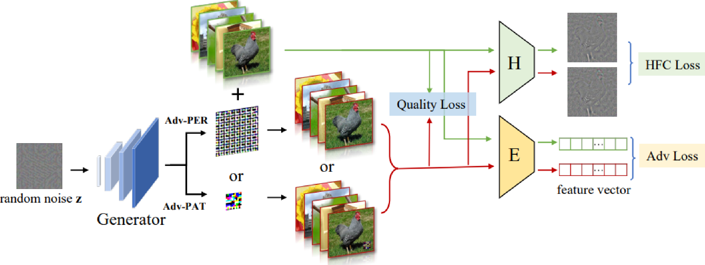

# AdvEncoder
The implementation of our ICCV 2023 paper "Downstream-agnostic Adversarial Examples"


## Abstract
Self-supervised learning usually uses a large amount of unlabeled data to pre-train an encoder which can be used as a general-purpose feature extractor, such that downstream  users only need to perform fine-tuning operations to enjoy the benefit of ``large model". Despite this promising prospect, the security of pre-trained encoder has not been thoroughly investigated yet, especially when the pre-trained encoder is publicly available for commercial use. 

In this paper, we propose AdvEncoder, the first framework for generating downstream-agnostic universal adversarial examples based on the pre-trained encoder. AdvEncoder aims to construct a universal adversarial perturbation or patch for a set of natural images that can fool all the downstream tasks inheriting the victim pre-trained encoder. Unlike traditional adversarial example works, the pre-trained encoder only outputs feature vectors rather than classification labels. Therefore, we first exploit the high frequency component information of the image to guide the generation of adversarial examples. Then we design a generative attack framework to construct adversarial perturbations/patches by learning the distribution of the attack surrogate dataset to improve their attack success rates and transferability. Our results show that an attacker can successfully attack downstream tasks without knowing either the pre-training dataset or the downstream dataset. We also tailor four defenses for pre-trained encoders, the results of which further prove the attack ability of AdvEncoder.



## Latest Update
**2023/8/24**   We have released the official implementation code.

## Setup
- **Get code**
```shell 
git clone https://github.com/CGCL-codes/AdvEncoder.git
```

- **Build environment**
```shell
cd AdvEncoder
# use anaconda to build environment 
conda create -n AdvEncoder python=3.8
conda activate AdvEncoder
# install packages
pip install -r requirements.txt
```
- **The final project should be like this:**
    ```shell
    AdvEncoder
    └- utils
        └- predict
    └- model
        └- adv_gan
    └- data
    └- victims
        └- cifar10 (pre-training dataset)
          └- simclr
             └- simclr-cifar10-b30xch14-ep=999.ckpt
             └- clean_model
    └- output
    └- ...
    ```

- **Download Victim Pre-trained Encoders**
  - All of our pre-trained encoders were obtained from the [solo-learn](https://github.com/vturrisi/solo-learn)  repository, and some missing pre-trained encoders were trained by us based on their code.
  - Please move the downloaded pre-trained encoder into  /victims/[pre-dataset]/[method].


### CIFAR-10

| Method       | Backbone | Epochs | Acc@1 | Acc@5 | Checkpoint |
|--------------|:--------:|:------:|:--------------:|:--------------:|:----------:|
| Barlow Twins | ResNet18 |  1000  |  92.10     |     99.73      | [Link](https://drive.google.com/drive/folders/1L5RAM3lCSViD2zEqLtC-GQKVw6mxtxJ_?usp=sharing) |
| BYOL         | ResNet18 |  1000  |  92.58     |     99.79      | [Link](https://drive.google.com/drive/folders/1KxeYAEE7Ev9kdFFhXWkPZhG-ya3_UwGP?usp=sharing) |
|DeepCluster V2| ResNet18 |  1000  |  88.85     |     99.58      | [Link](https://drive.google.com/drive/folders/1tkEbiDQ38vZaQUsT6_vEpxbDxSUAGwF-?usp=sharing) |
| DINO         | ResNet18 |  1000  |  89.52     |     99.71      | [Link](https://drive.google.com/drive/folders/1vyqZKUyP8sQyEyf2cqonxlGMbQC-D1Gi?usp=sharing) |
| MoCo V2+     | ResNet18 |  1000  |  92.94     |     99.79      | [Link](https://drive.google.com/drive/folders/1ruNFEB3F-Otxv2Y0p62wrjA4v5Fr2cKC?usp=sharing) |
| MoCo V3      | ResNet18 |  1000  |  93.10     |     99.80      | [Link](https://drive.google.com/drive/folders/1KwZTshNEpmqnYJcmyYPvfIJ_DNwqtAVj?usp=sharing) |
| NNCLR        | ResNet18 |  1000  |  91.88     |     99.78      | [Link](https://drive.google.com/drive/folders/1xdCzhvRehPmxinphuiZqFlfBwfwWDcLh?usp=sharing) |
| ReSSL        | ResNet18 |  1000  |  90.63     |     99.62      | [Link](https://drive.google.com/drive/folders/1jrFcztY2eO_fG98xPshqOD15pDIhLXp-?usp=sharing) |
| SimCLR       | ResNet18 |  1000  |  90.74     |     99.75      | [Link](https://drive.google.com/drive/folders/1mcvWr8P2WNJZ7TVpdLHA_Q91q4VK3y8O?usp=sharing) |
| SupCon       | ResNet18 |  1000  |  93.82     |     99.65      | [Link](https://drive.google.com/drive/folders/1VwZ9TrJXCpnxyo7P_l397yGrGH-DAUv-?usp=sharing) |
| SwAV         | ResNet18 |  1000  |  89.17     |     99.68      | [Link](https://drive.google.com/drive/folders/1nlJH4Ljm8-5fOIeAaKppQT6gtsmmW1T0?usp=sharing) |
| VIbCReg      | ResNet18 |  1000  |  91.18     |     99.74      | [Link](https://drive.google.com/drive/folders/1XvxUOnLPZlC_-OkeuO7VqXT7z9_tNVk7?usp=sharing) |
| VICReg       | ResNet18 |  1000  |  92.07     |     99.74      | [Link](https://drive.google.com/drive/folders/159ZgCxocB7aaHxwNDubnAWU71zXV9hn-?usp=sharing) |
| W-MSE        | ResNet18 |  1000  |  88.67     |     99.68      | [Link](https://drive.google.com/drive/folders/1xPCiULzQ4JCmhrTsbxBp9S2jRZ01KiVM?usp=sharing) |


### ImageNet-100

| Method                  | Backbone | Epochs | Acc@1 | Acc@5| Checkpoint |
|-------------------------|:--------:|:------:|:--------------:|:---------------:|:----------:|
| Barlow Twins| ResNet18 |   400  | 80.38     |     95.28      |  [Link](https://drive.google.com/drive/folders/1rj8RbER9E71mBlCHIZEIhKPUFn437D5O?usp=sharing) |
| BYOL        | ResNet18 |   400  | 80.16     |     95.02       |  [Link](https://drive.google.com/drive/folders/1riOLjMawD_znO4HYj8LBN2e1X4jXpDE1?usp=sharing) |
| DeepCluster V2          | ResNet18 |   400  |75.36     |     93.22       | [Link](https://drive.google.com/drive/folders/1d5jPuavrQ7lMlQZn5m2KnN5sPMGhHFo8?usp=sharing) |
| DINO                    | ResNet18 |   400  | 74.84     |     92.92       | [Link](https://drive.google.com/drive/folders/1NtVvRj-tQJvrMxRlMtCJSAecQnYZYkqs?usp=sharing) |
| MoCo V2+    | ResNet18 |   400  | 78.20     |     95.50       |  [Link](https://drive.google.com/drive/folders/1ItYBtMJ23Yh-Rhrvwjm4w1waFfUGSoKX?usp=sharing) |
| MoCo V3     | ResNet18 |   400  | 80.36     |     95.18       |  [Link](https://drive.google.com/drive/folders/15J0JiZsQAsrQler8mbbio-desb_nVoD1?usp=sharing) |
| NNCLR       | ResNet18 |   400  | 79.80     |     95.28       |  [Link](https://drive.google.com/drive/folders/1QMkq8w3UsdcZmoNUIUPgfSCAZl_LSNjZ?usp=sharing) |
| ReSSL                   | ResNet18 |   400  | 76.92     |     94.20       |   [Link](https://drive.google.com/drive/folders/1urWIFACLont4GAduis6l0jcEbl080c9U?usp=sharing) |
| SimCLR      | ResNet18 |   400  | 77.64     |     94.06        |    [Link](https://drive.google.com/drive/folders/1yxAVKnc8Vf0tDfkixSB5mXe7dsA8Ll37?usp=sharing) |
| SupCon                  | ResNet18 |   400  | 84.40     |     95.72        | [Link](https://drive.google.com/drive/folders/1BzR0nehkCKpnLhi-oeDynzzUcCYOCUJi?usp=sharing) |
| SwAV                    | ResNet18 |   400  | 74.04     |     92.70       |   [Link](https://drive.google.com/drive/folders/1VWCMM69sokzjVoPzPSLIsUy5S2Rrm1xJ?usp=sharing) |
| VIbCReg                 | ResNet18 |   400  | 79.86     |     94.98       |   [Link](https://drive.google.com/drive/folders/1Q06hH18usvRwj2P0bsmoCkjNUX_0syCK?usp=sharing) |
| VICReg      | ResNet18 |   400  | 79.22     |     95.06       |  [Link](https://drive.google.com/drive/folders/1uWWR5VBUru8vaHaGeLicS6X3R4CfZsr2?usp=sharing) |
| W-MSE                   | ResNet18 |   400  | 67.60     |     90.94       |    [Link](https://drive.google.com/drive/folders/1TxubagNV4z5Qs7SqbBcyRHWGKevtFO5l?usp=sharing) |


## Quick Start
- **Train AdvEnoder-PER**
```shell 
python gan_per_attack.py   # results saved in /output/[pre-dataset]/uap_results/gan_per
```
- **Train AdvEnoder-PAT**
```shell 
python gan_pat_attack.py  # results saved in /output/[pre-dataset]/uap_results/gan_patch
```
- **Train downstream classifiter**
```shell 
python train_down_classifier.py # clean models saved in /victims/[pre-dataset]/[victim-encoder]/clean_model
```
- **Test performance of AdvEncoder**
```shell 
python test_down_classifier.py # results saved in /output/[pre-dataset]/log/down_test
```

## Acknowledge

We greatly appreciate the immense contribution of the [solo-learn](https://github.com/vturrisi/solo-learn) team in the field of self-supervised learning by open-sourcing their repository.

## BibTeX 
If you find AdvEncoder both interesting and helpful, please consider citing us in your research or publications:
```bibtex
@inproceedings{zhou2023advencoder,
  title={Downstream-agnostic Adversarial Examples},
  author={Zhou, Ziqi and Hu, Shengshan and Zhao, Ruizhi and Wang, Qian and Zhang, Leo Yu and Hou, Junhui and Jin, Hai },
  booktitle={Proceedings of the IEEE/CVF International Conference on Computer Vision (ICCV'23)},
  year={2023}
}
```
